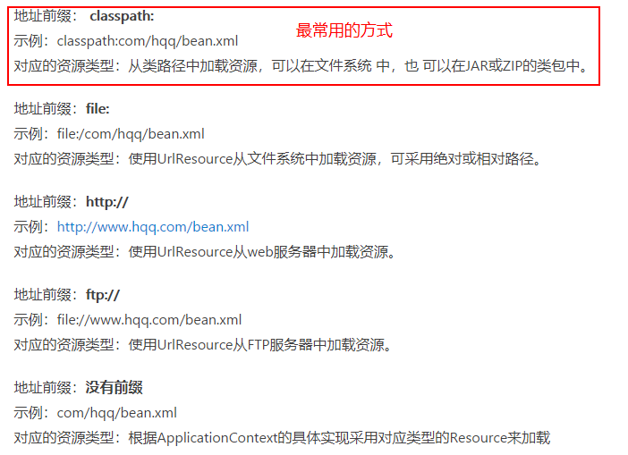
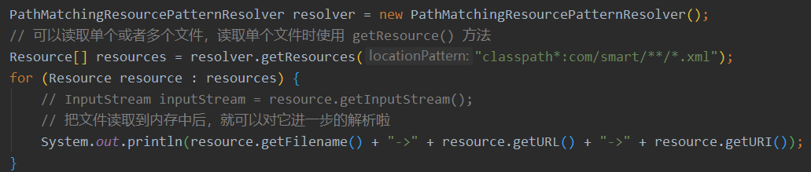
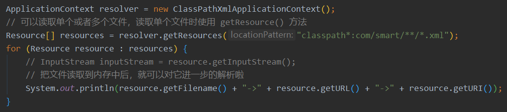

# Spring 中的 Resource

Spring 程序中不可避免的会需要使用到配置文件，要让配置文件起作用，就必须要通过把文件读取到内存中，然后进行解析，再进行后续的一系列操作。但是，J**DK 中提供的 java.net.URL、java.io.File 等不能够很好的满足各种使用需求。所以，Spring 中基于 JDK 中原生的 API 做了一层封装，能够满足于各种各样的资源读取功能（读取 Spring 中的配置文件、国际化资源文件等）**。

Spring 中提供了一系列的类和方法来读取资源，顶层的接口是 org.springframework.core.io.Resource ，具体的类继承结构如下：

实现了 Resource 接口的实现类有很多，但是你一个都不需要掌握，因为 Spring 提供了一个类 PathMatchingResourcePatternResolver 配合资源地址表达式来读取资源文件，它内部会根据资源表达式的地址前缀来决定使用哪一个实现类执行具体的资源读取操作。

## 资源地址表达式

### Ant 风格的资源地址支持 3 种匹配符

- `?`：匹配文件名中一个字符。如     classpath:com/h?q/bean.xml
- `*`：匹配文件名中的任意字符。如 classpath:com/hqq/*.xml
- `**`：匹配多层路径。如 classpath:com/*/.xml

### `classpath:`与`classpath*:`的区别

如果有多个 JAR 包或文件系统类路径都有相同的包名（如 com.hqq），`classpath:` 只会在第一个加载的com.hqq包的类路径下查找资源。`classpath*:`会扫描所有这些JAR包及类路径下出现的 com.hqq 类路径。如果是使用 Maven 构建的多模块项目，一定不要忘记这个区别了。

## 读取配置文件的方式

Spring 中读取资源文件有两种方式：

- 直接使用 PathMatchingResourcePatternResolver 类对象来读取资源文件

- 使用 ApplicationContext 对象来读取资源文件（内部间接使用到了PathMatchingResourcePatternResolver 类 ）

## 总结

- 在使用 Resource 对象的 getFile() 方法或者是 getInputStream() 方法都可以得到资源文件信息。但是如果这个资源文件在被打包到 jar 包中后，通过 getFile() 方法是会抛出 FileNotFoundException ，这种情况下，就应该使用 getInputStream() 方法得到 InputStream 对象。
- 这个 Resource 就是 Spring 底层中读取资源文件的技术，所谓的 @PropertySource 注解内部也是利用了这个功能啦，只不过它还能够解析数据