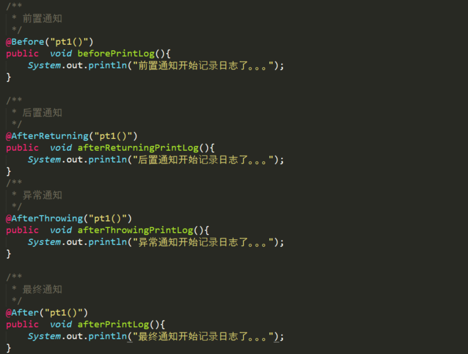
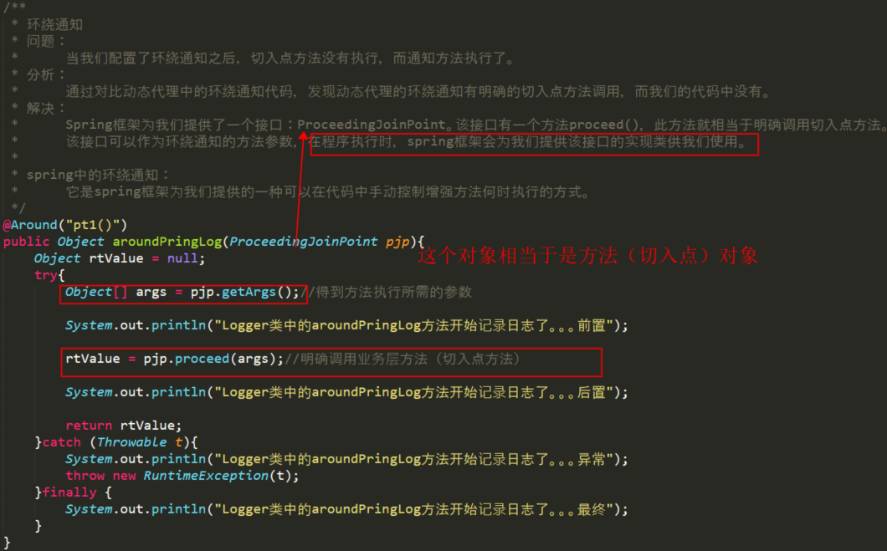
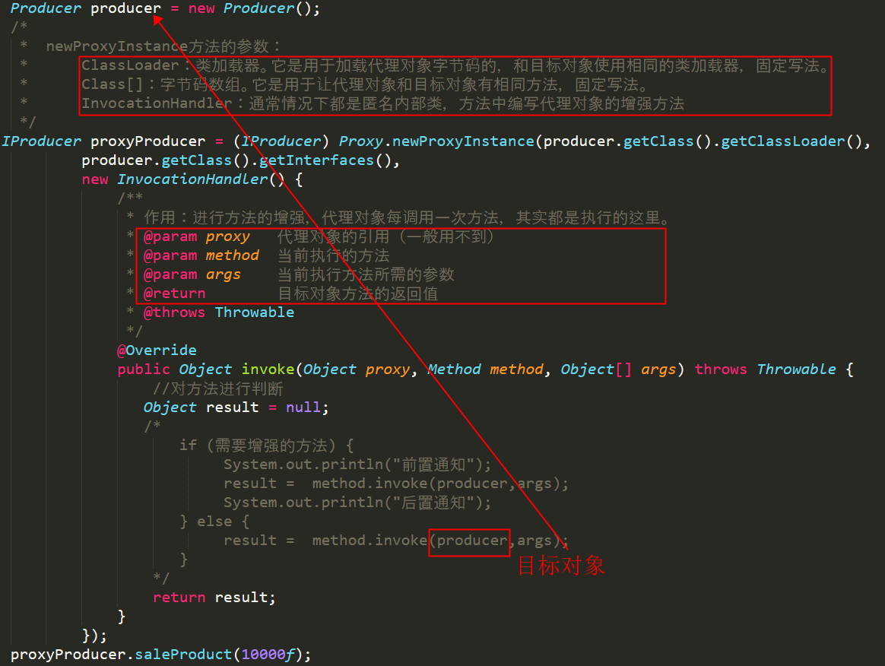
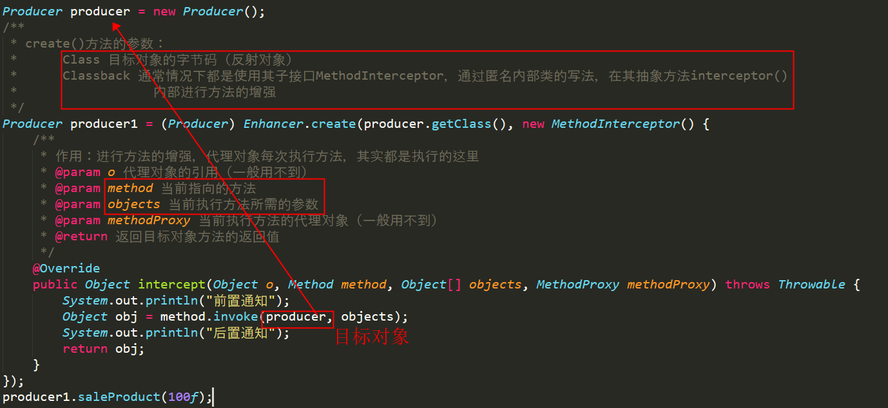
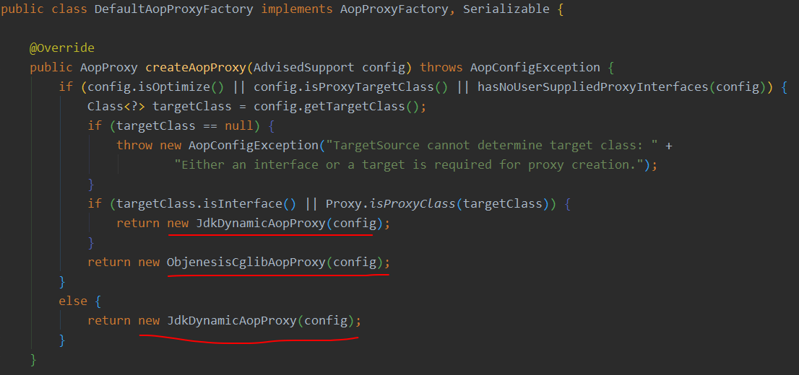

# Spring AOP

开发应用时，无论是哪种类型的系统，或者是一个系统中的多个模块，都有共同的、非业务功能的需求。比如重要操作需要记录日志，执行操作之前进行权限检查，涉及到数据库操作时，要保证业务操作的事务性，对耗时方法的执行时间进行统计。

这种非业务功能需求的代码，每个方法都需要重复写写一份，显然是不可以的。即使使用模板设计模式或者是装饰器模式也只能够一定程度减缓这种现状，而Spring框架基于代理模式思想实现的AOP则能够很好的解决这个问题。尽管只是在源代码编写阶段减少了重复代码，降低了程序的耦合度。实际执行时，仍然是大量的重复代码在起执行，但是对于计算机来说，无所谓。毕竟所谓的设计模式、解耦都是给人看的，并不是给计算机用的。

## 什么是AOP

Spring IOC 会通过配置文件是否进行了 AOP 相关的配置，来动态决定到底应该采用目标对象还是代理对象。代理对象是对原有目标对象的方法进行了增强，所以一旦采用了代理对象，就会出现和原有不一样的效果。

Spring AOP 的真正思想其实是为了形成可重用的组件，促使软件系统去进行关注点分离。一切都是为了解耦，一切都是为了解耦，一切都是为了解耦。重要的事情说三遍啊！！！而且是基于方法的！比如：用户服务就专心负责用户相关功能实现即可，什么日志管理、事务管理这种任何模块都需要的，就把它抽离出来，做成一个公共组件，然后通过动态代理的技术塞到其他功能模块里面去。这就是Spring AOP的核心思想，本质上就是为了做到关注点分离，实现代码的解耦，把一个大的复杂的问题变成多个，小简单的问题。

Spring 的 AOP 底层技术就是使用的 JDK 动态代理和 cglib 动态代理，它会根据具体的情况选择用哪个技术（优先使用 JDK 动态代理）。这个过程是在 BeanPostProcessor 中进行对象的替换的，也就是把目标对象抛弃，然后保留代理对象到 IOC 容器中。

## AOP相关术语

- 连接点（Joinpoint）：目标类的所有方法，因为所有方法都可能被增强
- 切入点（Pointcut）：就是目标类中被增强的方法
- 切面类（Aspect Class）：编写出来专门作为对目标类方法增强的一个类，如果你自己编写 AOP，那你肯定是需要
- 通知（Advice）：就是切面类中由程序员添加的用于在切入点之前或之后执行的方法，比如权限验证方法和日志记录方法
- 目标类（Target）：就是原有目标类啊
- 代理类（Proxy）：通过动态代理技术生成的代理对象
- 切面（Aspect）：切入点和通知的组合，就是一个切面。比如save()和writeLog()两个方法就组成了一个切面。面向切面编程就是在原有的方法之前或之后添加方法，组成一个新的方法呗。
- 织入（Weaving）：这里指的是一个过程，即把增强目标加到目标对象中的那个过程

## 通知的类型

- 前置通知：在切入点之前执行的方法，比如权限验证方法。
- 后置通知：在切入点之后执行的方法，比如日志记录方法
- 环绕通知：在切入点之前和之后都会执行的方法，比如记录当前时间的方法，通常用于测试系统性能
- 异常抛出通知：在切入点出现异常的时候会执行的方法，无非就是捕捉到异常后，先执行此方法，再抛出异常而已
- 最终通知：无论切入点是否出现异常，都会执行该方法，其实就是把通知加在了     finally代码块之内呗

## 切入点表达式的写法

切入点表达式负责指定哪个类的哪个方法为切入点。它的格式为：`方法返回值+包名.类名.方法名(方法的参数)`，其中除了参数之外，其他任何一个位置都可以用通配符.*表示（多级子包的情况下这样使用）。方法的参数用..表示！具体示例如下：

```java
@Before("execution (* com.keqi..*.service..*.*(..))")
```

## SpringBoot 框架中如何使用 AOP

Spring 框架提供了基于动态代理技术的 AOP 功能给开发人员使用，**开发人员只需要按照 Spring AOP 的规则编写对应的切面类以及指定哪些类的哪些方法需要被增强即可**。Spring IOC 容器在初始化对象的时候，就会根据配置去创建这些代理对象，然后放到 IOC 容器中（至于原始的目标对象以及增强链中的其他代理对象，都会被直接抛弃，IOC 容器中不会存储它们）。可以通过 XML 的方式，也可以通过注解的方式进行 AOP 的配置，推荐使用注解的方式，毕竟现在都是使用 SpringBoot 了，你想用 XML ，也没法用啊。**如果是使用的 AnnotationConfigApplicationContext 的话，需要在主配置类中使用 @EnableAspectJAutoProxy 注解开启AOP注解扫描支持（纯注解方式）**

### AOP相关的注解

- @Aspect 用在类声明上，表示当前类是一个切面类。要想让IOC管理，还需要配合@Component一起使用

```java
@Component("logger")
@Aspect // 表示当前类是一个切面类
public cLass Logger { }
```

- @PointCut用在方法上，表示这是一个切入点。出于复用的目的，可以单独配置出来，其他类型的通知直接引用这个方法即可。这里还可以通过指定注解的方式来定义切入点，使用示例如下：

```java
@Pointcut("execution(* com.keqi.*.*(..))")
private void pt1(){}

// 直接找到所有使用了这个注解的方法
@Point('@annotation(com.keqi.common.annotation.Log)')
public void logPointCut(){}
```

- @Before 用在方法上，表示这是一个前置通知
- @AfterReturning 用在方法上，表示这是一个后置通知
- @AfterThrowing 用在方法上，表示这是一个异常通知
- @After 用在方法上，表示这是一个最终通知



- @Around 用在方法上，表示这是一个环绕通知



## Spring AOP 的实现原理

Java 是一个面向对象的语言，如果我们想要创建一个对象，首先需要编写一个 Java 类，然后再以这个类为模板，去创建一个对象。但是有的时候我们希望在程序中动态的生成一个没有 .java 文件类模板的对象，这个时候就需要用到动态代理技术了。

动态代理，即在运行期间通过字节码的方式生成对象，从而避免了需要先写一个 .java 文件，然后进行编译，再去创建对象的步骤。在 JDK 中提供了一个基于接口的 JDK 动态代理技术，另一个常用的代理技术则是 cglib 动态代理。这两者用起来其实也很简单，主要是理解这种思想。

代理的使用方式其实很简单，核心之处就在于如何进行编写这里面的增强逻辑。一旦代理对象创建成功后，调用代理对象的任何方法都会进入这段代理逻辑（但是不代表所有方法都会增强，内部是会根据条件判断，决定是否增强还是直接放行的哦）。以及代理对象之间还可以层层嵌套，一个代理对象套着一个代理对象。

### JDK 动态代理

JDK 动态代理采用的是 java.lang.reflect 包下的 Proxy 类的 newProxyInstance() 方法生成的代理对象，这种方式要求目标类必须实现一个接口，否则无法创建代理对象。JDK动态代理的具体实现涉及到了一个类（Proxy）和一个接口（InvocationHandler）以及他们各自的一个方法newProxyInstance()和invoke()，具体代码实现如下：



### cglib 动态代理

cglib 动态代理用于填充 JDK 动态代理不支持的方式（JDK 动态代理要求目标类至少实现一个接口）。cglib 代理要求目标类必须可以被继承，也就是不可以被final关键字修饰，因为这里的代理对象，是通过继承的方式产生的。cglib 动态代理则是涉及到了两个类 Enhancer 和 MethodInterceptor 以及他们各自的一个方法create()和intercept()，具体代码实现如下（需要导入 cglib 的 jar 包）：



### Spring AOP 的具体实现

在 IOC 容器初始化时，也就是创建各种 Bean 对象的时候，Spring 就会根据 XML 或者是注解的配置决定到底要不要创建代理对象，应该使用 JDK 代理还是 Cglib 代理。注意，IOC 容器存储的是一个最终的代理对象，原始的目标对象以及层层代理链中的中间代理对象是会直接被抛弃的，因为它们已经完成了自己的历史使命，到了可以被人抛弃的时候了。懂不！资本家就是这么残酷，你已经没有利用价值了，那还留着你干嘛呢？核心代码就在 DefaultAopProxyFactory 类的 createAopProxy() 方法中，其实就是一个 if else 而已啦。代码如下：



## 参考链接：

- https://blog.csdn.net/tianyaleixiaowu/article/details/70853147