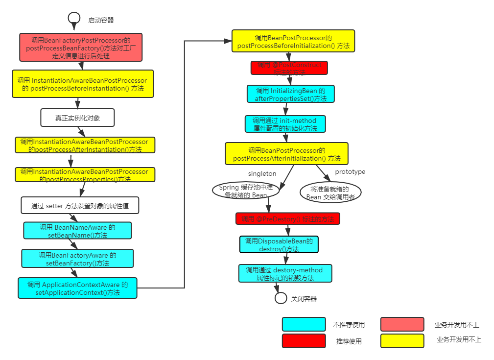

# Spring Bean的生命周期

在 Java 中，对象的生命周期从 new 开始，一直到被 GC 回收，这就是 Java 对象的生命周期。但是如果项目中使用了 Spring 框架，那么创建对象的权利就会交给IOC 来管理，那么它就会在这个基础上加上一些 Spring 特有的生命周期方法。了解这个机制，有时候会非常有用，比如想要在对象正式被使用之前做一些操作，完全可以利用这个机制来完成，从而避免什么东西都需要用静态代码块来实现，只要实现对应接口的以及抽象方法即可。

其实从 Java 的角度来说，对象已经创建出来了，但是 IOC 还会做很多其他操作，最后才把这个对象放到 IOC 容器中。而如果要使用 IOC 容器中的对象，那就必须要等到 IOC 容器这个对象全部初始化完毕后，才能做使用。这就保证了这些方法都会在实际对象使用之前被执行。**IOC 容器的本质是为了管理 Bean，但是 Bean 的初始化和销毁也是需要一个过程的，这个过程就是 Bean 的生命周期。**

## ApplicationContext 容器中 Bean 的生命周期

如果想要在 Bean 对象被使用之前或者销毁之后的生命阶段执行一些功能，就需要实现以上的接口，并实现对应的抽象方法，这些方法即会在对应的时期被调用。

Bean 生命周期所经历的方法可以分为 4 类，如下：

- Bean 自身的方法：如果想要在 Bean 的生命周期阶段实现一些功能，推荐通过 Bean 自身的方法来实现
  - 初始化方法
    - 使用`<bean/>`标签中的 init-method 属性标记的方法（仅限于使用 XML 配置时使用）
    - 使用 @PostConstruct 注解标记的 Bean 自身的方法（**推荐使用**）
  - 销毁方法
    - 使用`<bean/>`标签中的 destroy-method 属性标记的方法（仅限于使用 XML 配置时使用）
    - 使用 @PreDestory 注解标记的 Bean 自身的方法（**推荐使用**）
- Bean 级别的生命周期涉及到的接口：**不推荐使用**，因为这使得 Bean 不再是一个 POJO 了，有很强的侵入性。尽管很多人都会用这几个接口，但这不是一个规范的用法。
  - BeanNameAware
  - BeanFactoryAware
  - ApplicationContextAware
  - InitializingBean
  - DisposableBean
- 容器级别的生命周期涉及到的接口：这个在实际的业务开发中用的很少，但是却非常的重要。他们本质上都是 BeanPostProcessor （Bean 的后置处理器）接口或者它的子接口。比如 Spring AOP 的功能就是通过后置处理器实现的。
  - InstantiationAwareBeanPostProcessor
  - BeanPostProcessor
- 工厂后置处理方法：这种仅仅针对 IOC 工厂的生命周期使用，了解即可
  - BeanFactoryPostProcessor

## 总结

Spring Bean 的生命周期在实际业务开发中也是一个经常用到的知识点，牢牢掌握这 4 类生命周期方法即可。**如果是想要在 Bean 的初始化或者销毁阶段执行的方法则推荐使用 @PostConstruct/@PreDestory 。如果是希望在程序启动之后执行的一些操作，就不应该利用单个 Bean 的生命周期方法（尽管这样也能够实现功能，但这不是正确的用法），而是转而使用 SpringBoot 提供的 CommandLineRunner 或者 ApplicationRunner 接口。**

## 参考链接

- https://blog.csdn.net/qq_29229567/article/details/83785672
- https://juejin.im/post/5daced865188255a270a0de6
- https://juejin.im/post/5ddbedb76fb9a07a79353403
- https://juejin.im/post/5daced865188255a270a0de6
- https://segmentfault.com/a/1190000014105687