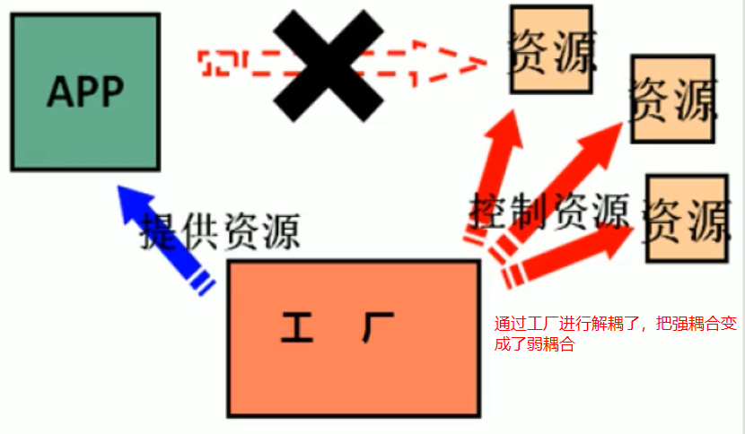
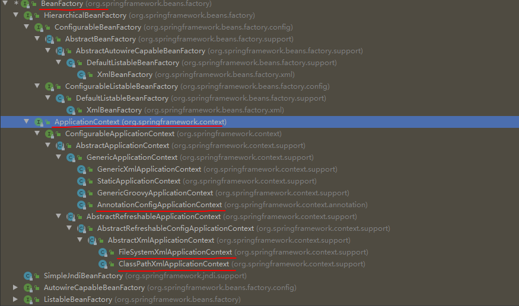
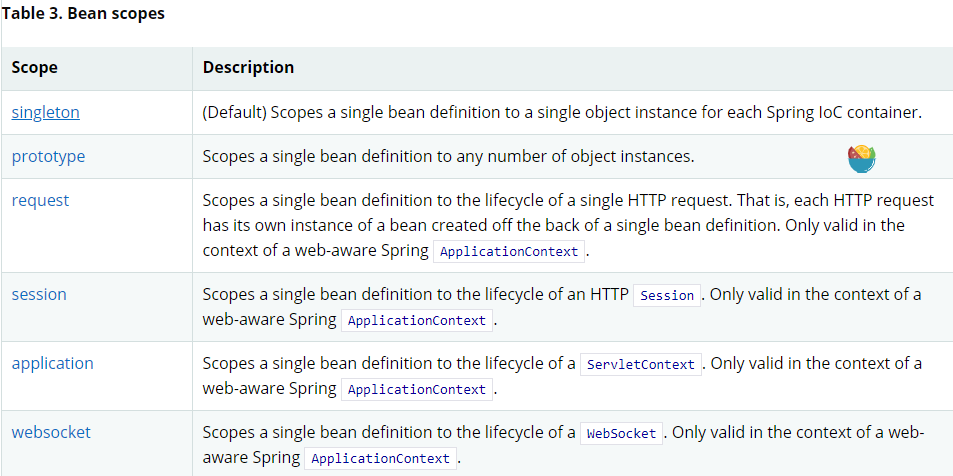

# Spring IOC

每个写代码的工程师都一直在追求高内聚、低耦合的代码。目的就是为了降低程序的复杂度，Spring IOC就是这样一项用来解耦的技术。代码中的耦合可以分为两类：

- 类和类之间的耦合（使用 Spring IOC 来解决）
- 方法和方法之间的耦合（使用 Spring AOP 来解决）

 IOC 解耦的思路是，让用户把需要创建的对象以及对象之间的依赖关系，统统在配置文件中进行配置，然后在程序启动的时候，通过读取配置信心，再利用反射技术来创建对象。从而避免使用开发人员手动的使用 new 关键字来创建对象，这样就可以把创建对象以及维护对象之间的关系交给 IOC 容器来完成了。

## IOC 容器

对于一个企业级应用程序来说，通常都会有大量的 JavaBean 对象。这个时候如果全部都是自己来管理对象以及对象之间的依赖关系的话，会非常的复杂。而且，可以很肯定的说，很少有人能够把这件事做好。这个时候就可以使用 Spring 框架来帮助我们管理对象以及对象之间的依赖关系，把创建对象的权利交给 Spring ，它就会帮你管好这件事。你需要什么，就管它要就行了。IOC 把强耦合变成低耦合，但是并没有消除耦合，耦合是不可能完全消除的。

Spring 框架内部管理这些 JavaBean 的东西就叫做 IOC 容器，也可以叫做 Bean 工厂（为什么这么叫？因为这个东西从设计模式的角度来看，就是一个很典型的工厂设计模式呀）。

- IOC 容器内部其实就是用了一个Map<String,Object> 来存储各个对象

- 为什么把这个Map叫做容器呢？Java中把小量的数据存储叫做集合，把复杂的叫做容器！！哈哈本质都是一样的

- IOC容器还有很多其他的名称，比如Spring容器、Bean工厂、应用上下文、ApplicationContext，说的都是这个Map啦。

- Bean 在计算机英语中，指定是可重用的组件。JavaBean就是指用Java语言编写的可重用组件。

## Spring 中的工厂类

Spring 中工厂类的顶层接口是 BeanFactory，但是这个是很早很早之前用的了。现在使用的都是 ApplicationContext 接口，它提供了更多的功能。具体实现了这个接口的实现类，主要有 5 种（JavaSE 环境下有3个，JavaEE 环境下有2个）。类层次结构如下：

BeanFactory 和 ApplicationContext 接口的区别：

- BeanFactory 工厂管理 Bean 对象，采用的是延迟加载的方式。也就是说，工厂对象初始化的时候，不会去创建 Bean 对象，而是等到外界向工厂索要对象的时候，才临时去创建。
- ApplicationContext 工厂管理 Bean 对象，采用的是立即加载的方式。也就是在工厂对象初始化的时候，就把全部的 Bean 对象创建好了。外界向工厂索要对象的时候，就直接从给它就行了。

ApplicationContext 接口的 5 个常用实现类：

- ClassPathXmlApplicationContext     ：从 classpath 路径下加载配置文件，从而创建 IOC 容器。（JavaSE环境下建议使用）

- FileSystemXmlApplicationContext：从磁盘的任意路径下加载配置文件，从而创建 IOC 容器。（不建议使用）

- AnnotationConfigApplicationContext：支持读取注解的方式创建 IOC 容器。（JavaSE环境下建议使用）

- XmlWebApplicationContext：从 classpath 路径下加载配置文件，从而创建 IOC 容器。（JavaWeb 环境下建议使用）

- AnnotationConfigWebApplicationContext：支持读取注解的方式创建 IOC 容器。（JavaWeb 环境下建议使用）

## Spring 中配置元数据的三种方式

- **XML-based configuration：**曾经很流行，但是现在已经不推荐使用了。SpringBoot 中直接就完全抛弃了 XML 配置。

- **Java-based configuration：**如果是第三方类库中的类，无法在别人写的源代码中配置注解时，推荐使用 new 关键字配合 @Bean 等注解声明对象。

- **Annotation-based configuration：**如果是自己写的类，那么直接在源码中通过 @Component 等注解可以声明对象。

## Spring IOC 容器中 Bean 对象的作用范围

IOC 容器中 Bean 对象默认都是 singleton 类型的，绝大部分情况下也应该是这种方式。其它的了解即可，好像还没有在工作中用到过！

## Spring 中的依赖注入

如果仅仅是创建一个个没有依赖关系的 Bean 对象，并把它们保存起来的话，那么根本就用不到 IOC （Inverse Of Control）容器了。之所以愿意把创建对象的权利让出去，就是因为没有能力管理 Bean 对象之间复杂的依赖关系啊。IOC 的核心之处就在于它能够管理这种复杂的依赖关系，作为用户的我们来说，只需要声明一下，我需要哪个 Bean 即可。IOC 容器去负责帮你注入这个对象，这就叫做依赖注入（Dependency Injection）。

依赖注入可以分为三种方式，分别是构造函数注入、set 方法注入、注解的方式。注入的数据又可以分为三类，分别是基本类型和String、其它Bean类型（IOC 容器中管理的 Bean ）以及集合类型。下面会一一介绍，但是实际工作中的需要进行依赖注入时，不会有这么复杂啦，大部分情况下都是很简单的方式。

### 构造函数注入（ Constructor-based dependency injection）

构造函数注入的方式，其实是 Spring5 推荐的方式。

### set 方法注入（Setter-based dependency injection）

set 方法的方式进行注入，也是一个非常常见的方式（尤其在 XML 配置的时代），不过到了注解的时代，用的就不多了。