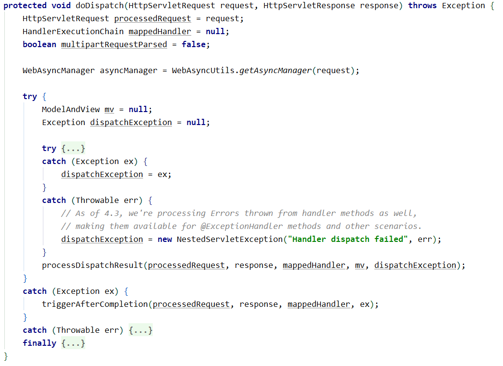

# Spring MVC 中的异常处理器

程序运行过程中不可避免的会遇到异常，这时候应该如何处理呢？有两种主要的处理方式：

- 根据业务需求，自己在程序中手动的捕获了异常，并进行处理。（业务开发中使用比较少，一旦使用到，就要格外留意）
- **业务代码中不处理异常，而是随着调用链不断的向上抛，最终交给 Spring MVC 中的异常处理器来处理。（业务开发中经常使用到）**

## Spring MVC 为什么能够处理异常

**每一个 HTTP 请求都会通过DispatcherServlet 类的 void doDispatch(HttpServletRequest request, HttpServletResponse response) 方法找到请求路径找到对应的控制器的具体方法，然后再调用该方法。整个过程是使用了一个 try catch 代码块包含起来了，这就使得 Spring MVC 框架有能力处理这个调用链往上抛出的异常。**源码如下：



## Spring MVC 配置异常处理器的 3 种方式

- 使用 @ExceptionHandler 注解**（不推荐使用）**

  - 该注解只能够处理它所在 Controller 类中的异常

- 实现 HandlerExceptionResolver 接口**（不推荐使用）**

  - 这种方式可以进行全局异常处理，但是无法更细分的去处理异常

- 使用 @Controlleradvice 和 @ExceptionHandler 注解**（推荐使用）**

  - 能够进行全局处理
  - **可以在一个类中编写多个方法，每个方法处理一个或者多个异常，从上至下交给对应的异常处理方法**
  - 如果需要返回JSON数据，就再在方法上加 @responseBody 注解即可

  ```java
  @ControllerAdvice
  public class GlobalExceptionHandler {
  
  	@ExceptionHandler(value = Throwable.class)
  	@ResponseBody
  	public AjaxEntity<Map<String, Object>> jsonErrorHandler(HttpServletRequest req, Throwable exception) throws Exception {
  		// 打印异常栈信息
  		exception.printStackTrace();
  		// 自定义异常则显示异常对象中指定的描述信息
  		if (exception instanceof CustomerException) {
  			return AjaxEntityBuilder.failure(exception.getMessage());
  		}
  		// 非自定义异常则统一显示"系统内部错误"字样
  		return AjaxEntityBuilder.failure("系统内部错误");
  	}
  }
  ```

## SpringBoot中特有的处理异常方式

SpringBoot 中的异常处理方式除了通过实现相关接口以及注解这两种方式，还可以通过提供一个 `/error` 路径对应的接口来实现异常处理的功能。因为SpringBoot 应用程序在抛出了异常后，会进行请求转发给 `/error` 对应的接口来处理。也就是说，我们完全可以提供一个 Controller 类，然后提供一个映射了`/error`请求路径的方法，在这个方法内部来统一处理异常。**(不推荐使用)**

