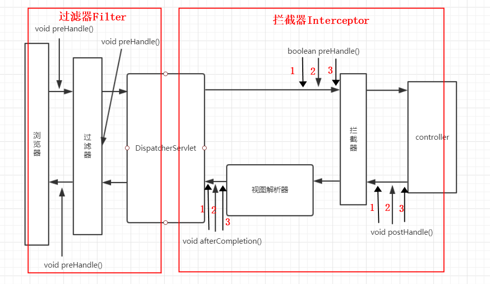

# Spring MVC 中的拦截器

有的时候，我们希望在用户访问具体的接口之前，进行一下过滤操作。比如，用户登录验证，用户权限验证等等。Servlet 规范中提供了一个 Filter 来实现这个功能，但是 Spring MVC 中屏蔽了 Servlet API。所以，它提供了 Interceptor 来替代 Filter，完成通用的功能。Spring MVC 提供了一个 HandlerInterceptor 接口，用于在访问具体的 Controller 之前或之后做一些过滤操作。有三个抽象方法，分别是：

- boolean preHandle(HttpServletRequest request, HttpServletResponse response, Object handler)
  - **请求访问具体的 Controller 之前被调用，用于完成一些前置工作。如果允许请求往后执行，就返回 true。如果不允许，就返回false 。**
- void postHandle(HttpServletRequest request, HttpServletResponse response, Object handler, @Nullable ModelAndView modelAndView)
  - Controller 执行完之后被调用，用于完成一些后置工作
- void afterCompletion(HttpServletRequest request, HttpServletResponse response, Object handler, @Nullable Exception ex)
  - 在视图解析器完成之后被调用，完成一些后置操作

## 拦截器的执行流程

**Spring MVC 程序中 Filter（过滤器） 和 Intercepter（拦截器）的执行流程图如下：**



**这种流程，本质上就是责任链模式。**以图中的 3 个拦截器为例，执行成功与否的执行逻辑如下：

- **全部执行成功时**
  - preHandler1
  - preHandler2
  - preHandler3 
  - postHandler3
  - postHandler2 
  - postHandler1 
  - afterCompletion3 
  - afterCompletion2 
  - afterCompletion1
- **拦截器1执行成功，拦截器2执行失败时**
  - preHandler1
  - preHandler2
  - afterCompletion1

## SpringBoot 中配置拦截器

SpringBoot 中配置拦截器需要两个步骤，如下：

- 编写一个实现了 HandlerInterceptor 接口的实现类，根据自己的需要决定实现该接口中 3 个方法中的一个或者多个
- 在实现了 WebMvcConfigurer 接口的类中重写 public void addInterceptors(InterceptorRegistry registry) 方法，并注册拦截器对象。

### 编写拦截器类

```java
@Component("securityInterceptor")
public class SecurityInterceptor implements HandlerInterceptor {

	@Override
	public boolean preHandle(HttpServletRequest request, HttpServletResponse response,
							 Object handler) throws Exception {
		// 在此处进行鉴权，通过就返回 true，未通过就直接返回 false，并使用 response 对象输出错误信息
		return true;
	}
}
```

### 注册拦截器对象

```java
@Configuration
public class WebMvcConfig implements WebMvcConfigurer {

	private final HandlerInterceptor securityInterceptor;

	public WebMvcConfig(@Qualifier("securityInterceptor") HandlerInterceptor securityInterceptor) {
		this.securityInterceptor = securityInterceptor;
	}

	/**
	 * 注册拦截器对象
	 * @param registry registry
	 */
	@Override
	public void addInterceptors(InterceptorRegistry registry) {
		// 注册一个安全拦截器，拦截除"/auth/authentication"之外的所有请求
		// 如果有多个拦截器，在这里加入的顺序就是拦截器之间执行的顺序
		registry.addInterceptor(securityInterceptor).addPathPatterns("/**").excludePathPatterns("/auth/authentication");
	}
}
```

## 参考链接

- https://juejin.im/post/5df4f5536fb9a0166243623c