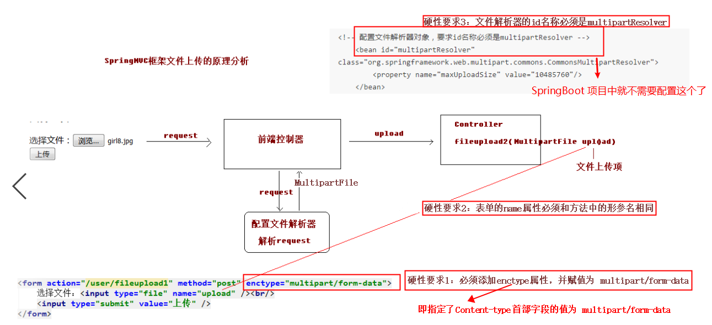
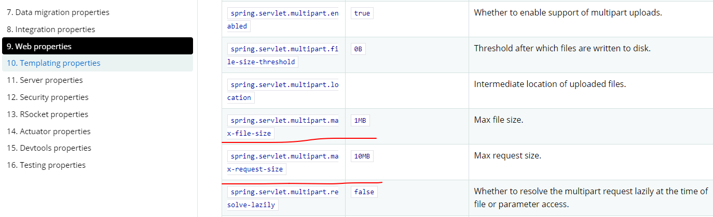

# Spring MVC中的文件上传

应用开发中不可避免的会遇到文件上传的需求，Spring MVC 对此也提供了支持。Spring MVC 提供了一个 MultipartResolver 接口统一抽象文件上传的实现。具体的实现类有两个，分别是：

- CommonsMultipartResolver
  - 在 Servlet3.0/Spring3.1 之前的版本时，只能用这个类来实现文件上传的功能。它内部使用的是 jakarta Common FileUpload jar 包提供的功能，所以，这个是需要导入第三方 jar 包的。**（不推荐使用）**
- StandardServletMultipartResolver
  - 这个是在 Servlet3.0/Spring3.1 版本之后新增的功能，无需引入第三方 jar 包。**（推荐使用）**

## SpringBoot 中实现文件上传

如果是在 Spring MVC 中是需要手动的配置 MultipartResolver 的，但是 SpringBoot 中就不需要了，因为它默认就帮你配置好了。如果要修改默认的文件上传配置的话，直接在 application.properties 文件修改即可。（使用的是 StandardServletMultipartResolver 类）

### 文件上传必须要遵循的 3 个必要条件



### 文件上传相关配置

SpringBoot 项目中并不推荐使用传统的 XML 进行配置，转而使用 properties 文件来进行配置。可以查阅官方文档和源码查看更多信息！



### 文件上传接口编写示例

```java
@RestController
public class FileUploadController {

	@PostMapping("/sys/upload")
	public AjaxEntity upload(@RequestParam("file") MultipartFile file, @RequestParam("id") Long id) {
		try {
			// 文件上传的同时，也是可以同时传递请求参数的，服务端只需要使用 @RequestParam 注解接收即可
			// Content-type 必须是 Multipart/form-data
			// 可以同时接收多个文件，只需要使用 MultipartFile[] 即可
			// 要想熟练掌握文件上传的各种使用技巧，其实只需要 MultipartFile 类的 API 即可
			file.transferTo(new File("D://xxx"));
		} catch (IOException e) {
			e.printStackTrace();
		}
		return AjaxEntityBuilder.success();
	}
}
```

## 文件上传的最佳实践

对于后端存储文件主要有两种方式，如下：

- 直接存储在部署了后台程序的本机文件系统中
  - 适合文件数目比较少的小型项目中使用，非常的方便
- 后台程序在接收到文件后，再转发给单独的文件服务器
  - 如果项目中有大量的文件，那么肯定是需要单独使用一个文件服务器中的。比如 MinIO、阿里云对象存储服务等

### CURD 的业务逻辑

文件上传通常都是伴随着业务操作的，而不是一个单独的文件上传。对于这种操作，也是可以抽象出固定的业务逻辑出来的，下面针对 CURD 进行总结。

#### 增加

- 增加基础信息
- 上传文件到文件服务器中，并获得对应的文件存储 url
- 存储文件url以及文件名到数据库中

```javascript
{
    "name": "小米",
    "firstLetter": "x",
    "brandStory": "品牌故事",
    "sort": 1,
    "showStatus": 1,
    "factoryStatus": 1,
    "logoList": [
        // 都是文件列表
    ],
    "bigPicList":[
        // 都是文件列表
    ]
}
```

#### 删除

- 删除基本信息
- 删除数据库中存储的文件url以及文件名称
- 删除文件服务器中存储的文件
  - 在原有的表结构中删除，再删除文件服务器上的文件（立即删除）
  - 在原有的表结构中进行逻辑删除，然后在内存中维护一个需要定时删除文件的数组，数组中指定了表名，以及开启一个定时任务，定时删除这些表中已经到期了的文件，再去真正删除文件服务器上的文件（保留指定的日期后再删除）

```javascript
{
    "id": 1
}
```

#### 修改

- 修改基础信息
- 从新增列表属性中，找到新增的文件，进行新增的相关操作
- 从删除列表属性中，找到需要删除的文件，进行删除的相关操作

```javascript
 {
        "name": "小米",
        "firstLetter": "x",
        "brandStory": "品牌故事",
        "sort": 1,
        "showStatus": 1,
        "factoryStatus": 1,
        "logoList": {
            "createList": [
                // 新增的文件列表
            ],
            "deleteList": [
                // 已经删除的文件id列表
            ]
        },
        "bigPicList":[
            "createList": [
                // 新增的文件列表
            ],
            "deleteList": [
                // 已经删除的文件id列表
            ]
        ]
}
```

#### 查询

- 查询基本信息
- 查询数据库中存储的文件url以及文件名称

查询基础信息之后，再查询对应的文件信息的方式：

- 两个一对多的映射(不推荐)(1)
- 使用MyBatis的分步查询(推荐)(1 * 10 * n)(不推荐)
- 程序中遍历，然后进行查询(1 * 10 * n)（不推荐）
- 程序中遍历，然后使用 in 辅助查询(n)(推荐)

```javascript
 {
        "name": "小米",
        "firstLetter": "x",
        "brandStory": "品牌故事",
        "sort": 1,
        "showStatus": 1,
        "factoryStatus": 1,
        "logoList": [
            "id", 1,
            "fileName" : "",
            "fileUrl" : ""
        ],
        "bigPicList":[
            "id", 1,
            "fileName" : "",
            "fileUrl" : ""
        ]
}
```

### 总结

其实并不需要每一个基础信息表对应一个文件表，而是可以采用基础信息类型 + 文件类型的方式进行区分，然后把所有文件名和url都存储在一个表里面就行，降低程序的复杂度，减少工作量。并抽象出一个工具类来，对外提供基础操作方法：

- 指定基础信息类型、文件类型后，负责上传文件、并且插入文件存储信息到文件表中

  ```java
  public void storageFiles(基础信息类型, 文件类型, 文件列表) {
      1、存储文件到文件服务器中，保存对应的url
      2、存储对应的文件url和文件名到统一的文件表中，并指定创建时间、基础信息类型、文件类型
  }
  ```

- 指定对应的文件id列表后，对相关的文件进行逻辑删除

  ```java
  public void deleteByFieldIds(id 列表) {
  	1、对于ids列表中的所有记录，统一进行逻辑删除操作，修改逻辑删除标识，指定删除时间
  }
  ```

- 指定对应的基础信息id列表后，对相关的文件进行逻辑删除

  ```java
  public void deleteByBaseInfoId(基础信息id, 基础信息类型) {
  	1、对于基础信息类型和基础信息id对应的所有记录，统一进行逻辑删除操作，修改逻辑标识，指定删除时间
  }
  ```

- 根据指定基础信息类型和文件类型查询对应的文件列表

其中，2、3、4 三个操作都是直接在统一文件表的 mapper 方法中完成的，只有 1 是需要在一个单独的工具类中进行编写的哦。

## 参考链接

- https://docs.spring.io/spring-boot/docs/2.3.1.RELEASE/reference/html/appendix-application-properties.html#web-properties
- https://blog.csdn.net/w3045872817/article/details/78429695